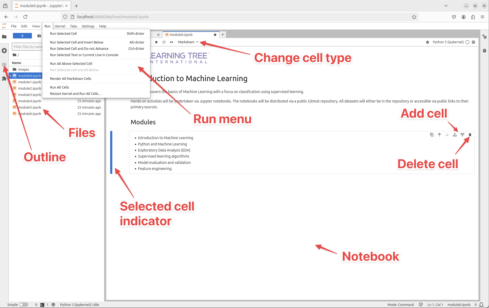
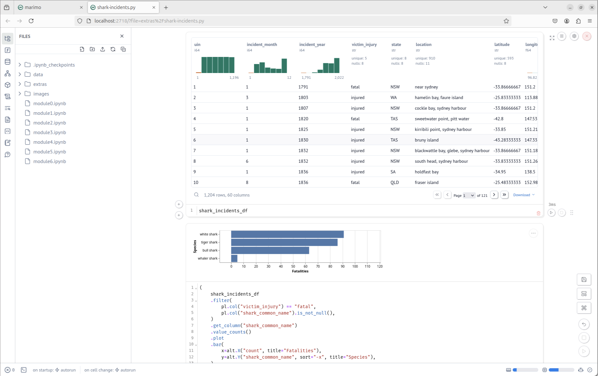

# Working with notebooks

The [materials](https://github.com/decisionmechanics/lt539j) for the course are available on GitHub. Clone or download them to follow along.

Notebooks are a popular tool for working with data. They allow code, text and data to be combined in flexible ways.

Popular notebooks technologies/tools are

- [JupyterLab](https://jupyterlab.readthedocs.io/en/latest/)
- [Marimo](https://marimo.io/)
- [Quarto](https://quarto.org)
- [DataSpell](https://www.jetbrains.com/dataspell/)

Alternatives to notebooks are IDEs, such as

- [PyCharm](https://www.jetbrains.com/pycharm/)
- [Visual Studio Code](https://code.visualstudio.com)

Most Python IDEs can work with notebooks, so there's a crossover between the two technologies.

## Setting up a virtual environment

Virtual environments aren't essential, but they allow us to isolate projects from each other.


https://xkcd.com/1987

To create and activate a virtual environment in Mac/Linux use

```bash
python3 -m venv venv
./venv/bin/activate
```

To create and activate a virtual environment in Windows use

```bash
py -m venv venv
.\venv\Scripts\activate
```

You should see the terminal prompt change to show you are operating in a virtual enviroment.

Check the version current version of Python.

```bash
python --version
```

To deactivate the virtual enviroment run the `deactivate` script.

```bash
deactivate
```

## JupyterLab

JupyterLab is the most popular notebook technology. As such, its the one we will use thoughout this course.

To install JupyterLab (with a virtual environment active) use

```bash
pip install jupyterlab
```

To start JupyterLab, navigate to the folder containing your notebooks (or the folder where you'd like any new notebooks to be) and run

```bash
jupyter lab
```

This will run the engine and launch a browser window. JupyterLab runs in a web browser.



Create a virtual environment, install JupyterLab and use it to open the notebook for Module 1 (i.e. this notebook).

When you `pip install` JupyterLab, add a few additional libraries at the same time.

```bash
pip install jupyterlab numpy 'polars[all]' scikit-learn
```

## Working with cells

Notebooks are built from cells. The two most important types of cells are

- Code cells (containing executable Python code)
- Markdown cells (containing text, titles, images, etc.)

## Python code

Code in a code cell is evalulated and the output is displayed below the cell. There's no need to use `print` to view results.

JupyterHub is able to format tabular data and display charts.

## Markdown

[Markdown](https://www.markdownguide.org/cheat-sheet/) is a lightweight text-formatting syntax.

Can be used to format

- Headings
- Links
- Images
- Lists
- Block quotes
- Code
- Bold text
- Italic text
- Strikethrough text
- Horizontal rules

## Shortcuts

JupyterHub can be controlled from the UI, but power users tend to use shortcut keys. Right-click on a cell to display a context menu complete with shortcut keys.

Common shortcut keys are

- `a`: insert cell above the selected cell
- `b`: insert cell below the selected cell
- `d`, `d`: delete the selected cell
- `m`: change to markdown cell
- `y`: change to code cell
- `z`: undo changes
- `1`-`6`: change cell to markdown heading
- `Shift`+`Enter`: execute selected cell

## Execution order

Python cells are only executed when you run them. If you run them out of order, you can get confusing results. If in doubt, run all cells from the start.

## Marimo

Marimo is an alternative (to JupyterHub) Python notebook environment. Features include

- Reactive execution (cells are rerun automatically, as required)
- Notebooks are stored as Python files
- More developer-oriented experience (e.g. GitHub Copilot, autocomplete, code formatting)

To install Marimo use

```bash
pip install marimo
```

To launch Marimo, navigate to the folder containing your (Marimo) notebooks and use

```bash
marimo edit
```



## Containers

Containers provide a much greater degree of isolation than virtual enviroments---including isolation of the file system and operating system configuration.

[Docker](https://docs.docker.com) is the most well-known tool for building container images and running containers.

To launch JupyterLab as a Docker container use

```bash
docker run --name jupyterlab -p 8898:8888 -d --rm quay.io/jupyter/datascience-notebook start-notebook.py --NotebookApp.token='my-token'
```

Then browse to http://127.0.0.1:8898/lab?token=my-token.

To stop the container use

```bash
docker stop jupyterlab
```

## Installing packages

There are three ways of installing packages in JupyterLab.

1. `pip install` the packages in the virtual environment before launching JupyterLab.
2. Launch an integrated terminal in JupyterLab and `pip install` packages.
3. Execute `!pip install ...` in a notebook code cell (`!` launches a shell command).
